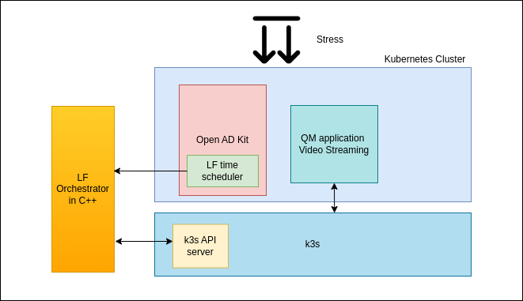

## Approach for Mixed criticality orchestration:

### Step 1:

Add curl packages in existing Open AD kit project. Modify the CMakeLists to add them.

### Step 2:

Write the Time threshold code to predict if deadline will be met or not

### Step 3:

Add the curl call in the threshold code and deadline code. Once these functions are triggered, corresponding REST calls must be done using curl library.

### Step 4:

A module by name container manager must be created. This is a server running outside the kubernetes.

### Step 5:

REST call coming from Open AD Kit container must reach the server running outside.

### Step 6:

Based on the rest call received, appropriate kubectl command must be triggered.

### Step 7:

Container manager must also monitor CPU, Memory availability from time to time and spawn QM container if it is not running. This process will take place in a seperate thread.
